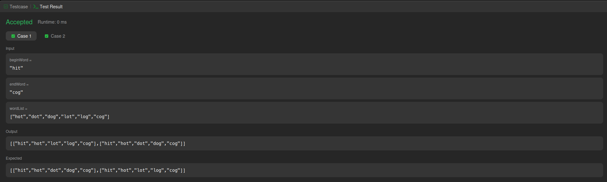
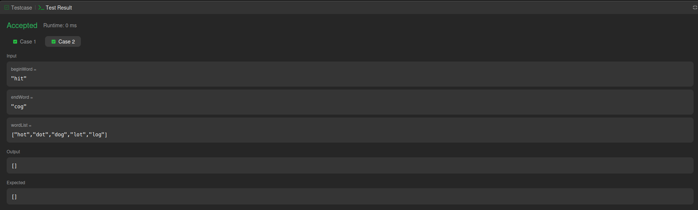
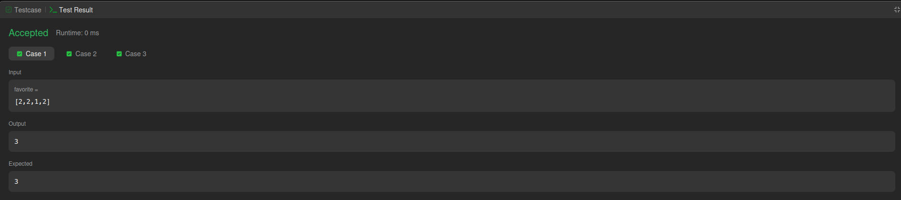
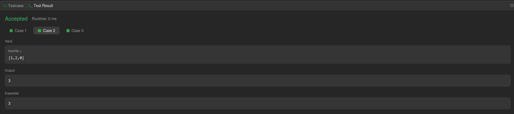
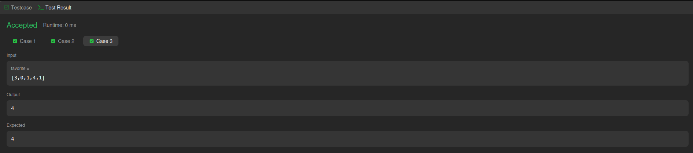
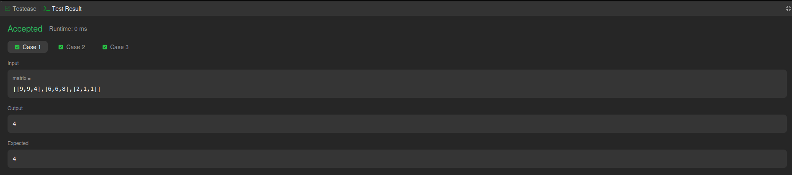
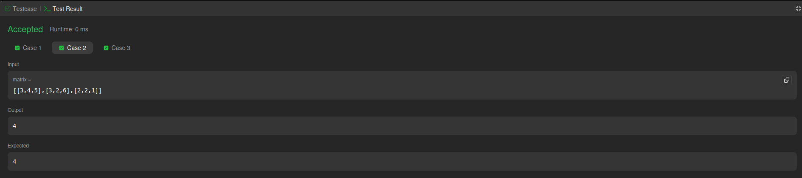
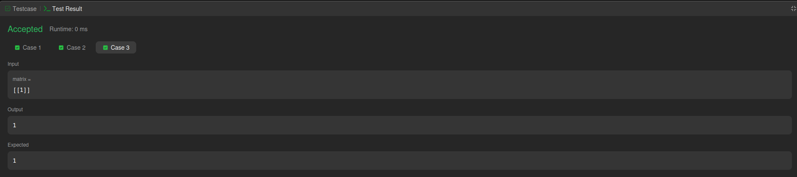

# Grafos - LeetCode And Labirinto

**Conteúdo da Disciplina**: Grafos

## Sobre

Este projeto consiste na resolução de questões da plataforma LeetCode na dificuldade difícil. O objetivo é utilizar o conteúdo estudado na disciplina de EDA2.

Foi igualmente implementado um jogo de resolução de labirintos, no qual aplicamos os algoritmos de busca em profundidade (DFS) e busca em largura (BFS).

## Questões

<center>

</head>
<body>

<table>
    <thead>
        <tr>
            <th>Questão</th>
            <th>Nível</th>
        </tr>
    </thead>
    <tbody>
        <tr>
            <td><a href="https://leetcode.com/problems/word-ladder-ii/description/" target="_blank">126. Word Ladder II</td>
            <td>Difícil 01</td>
        </tr>
        <tr>
            <td><a href="https://leetcode.com/problems/maximum-employees-to-be-invited-to-a-meeting/description/" target="_blank">2127. Maximum Employees to Be Invited to a Meeting</td>
            <td>Difícil 02</td>
        </tr>
         <tr>
            <td><a href="https://leetcode.com/problems/longest-increasing-path-in-a-matrix/description/" target="_blank">329. Longest Increasing Path in a Matrix</td>
            <td>Difícil 03</td>
        </tr>
    </tbody>
</table>

</body>
</html>

</center>

## Contribuidores

<center>
</head>
<body>

<table>
    <thead>
        <tr>
            <th>Matrícula</th>
            <th>Nome</th>
            <th>GitHub</th>
        </tr>
    </thead>
    <tbody>
        <tr>
            <td>202046102</td>
            <td>Felipe das Neves Freire</td>
            <td><a href="https://github.com/FelipeFreire-gf" target="_blank">Felipe</a></td>
        </tr>
        <tr>
            <td>222037700</td>
            <td>Leonardo de Melo Lima</td>
            <td><a href="https://github.com/leozinlima" target="_blank">Leonardo</a></td>
        </tr>
    </tbody>
</table>

</body>
</html>

</center>

## Linguagem Utilizada

- Python

## Uso

Entrar na plataforma [LeetCode](https://leetcode.com/problem-list/divide-and-conquer/), procurar pelo nome/número do exercício, colar na aba code e clicar em _Submit_

## Pré-requisitos para o GAME

Para executar o game do labirinto na sua máquina, é necessário ter instalados:

* **Python 3.10.0 ou superior**
* **pygame**

### Como executar o jogo

No terminal, dentro da pasta do projeto, execute:

```bash
python labirinto.py
```

## Tutorial do Game

Antes de iniciar o algoritmo, é possível desenhar o labirinto manualmente:

* Clique com o **botão esquerdo do mouse** e arraste para desenhar os muros do labirinto;
* Para apagar um muro, use o **botão direito do mouse**.

Controles do teclado:

* Pressione a tecla **`b`** para iniciar o algoritmo **BFS**;
* Pressione a tecla **`d`** para iniciar o algoritmo **DFS**;
* Pressione a tecla **`r`** para **reiniciar** o jogo.

Observações:

* O algoritmo também pode ser executado **sem nenhum muro desenhado**;
* Na tela, serão exibidos:

  * o **caminho percorrido** pelo algoritmo,
  * o **tempo de execução**,
  * e a **quantidade de passos** realizados.

## Screenshots do LeetCode e do Labirinto

<div align="center">
  <font size="4"><p style="text-align: center; margin-bottom: 50px;"><b>Figura 1: Resultados questão difícil LeetCode 126</b></p></font>
</div>


<div align="center">

</div>
<div align="center">
<div align="center">
  <font size="4"><p style="text-align: center; margin-bottom: 50px;"><b>Figura 2: Resultados questão difícil LeetCode 126</b></p></font>
</div>


<div align="center">

</div>
<div align="center">
<div align="center">
  <font size="4"><p style="text-align: center; margin-bottom: 50px;"><b>Figura 3: Resultados questão difícil LeetCode 2127</b></p></font>
</div>

<div align="center">

</div>
<div align="center">

<div align="center">
  <font size="4"><p style="text-align: center; margin-bottom: 50px;"><b>Figura 4: Resultados questão difícil LeetCode 2127</b></p></font>
</div>

<div align="center">

</div>
<div align="center">

<div align="center">
  <font size="4"><p style="text-align: center; margin-bottom: 50px;"><b>Figura 5: Resultados questão difícil LeetCode 2127</b></p></font>
</div>

<div align="center">

</div>
<div align="center">

<div align="center">
  <font size="4"><p style="text-align: center; margin-bottom: 50px;"><b>Figura 6: Resultados questão difícil LeetCode 329</b></p></font>
</div>

<div align="center">

</div>
<div align="center">

<div align="center">
  <font size="4"><p style="text-align: center; margin-bottom: 50px;"><b>Figura 7: Resultados questão difícil LeetCode 329</b></p></font>
</div>

<div align="center">

</div>
<div align="center">

<div align="center">
  <font size="4"><p style="text-align: center; margin-bottom: 50px;"><b>Figura 8: Resultados questão difícil LeetCode 329</b></p></font>
</div>

<div align="center">

</div>
<div align="center">

<div align="center">
  <font size="4"><p style="text-align: center; margin-bottom: 50px;"><b>Figura 9: Código BFS implementado no Labirinto</b></p></font>
</div>

<div align="center">

</div>
<div align="center">

<div align="center">
  <font size="4"><p style="text-align: center; margin-bottom: 50px;"><b>Figura 10: Código DFS implementado no Labirinto</b></p></font>
</div>

<div align="center">

</div>
<div align="center">

## Vídeo

Explicamos todos os códigos que fizemos na plataforma HackerRank e LeetCode:

<a href="https://youtu.be/TFeyVYnvyy4" target="_blank">
    <p align="center"><strong>Vídeo do Projeto</strong></p>
</a>
<p align="center">
  <a href="https://youtu.be/mxi5y95DNk8" target="_blank">
    
  </a>

